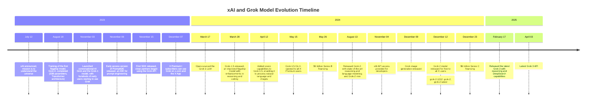

## Mindset

Always remember: this is Elon Musk's creation. xAI is currently considered a top-tier large language model provider, on the same level as Google, OpenAI, and Anthropic.


# xAI

You can learn more about the company xAI at --> [company](https://x.ai/company). We all know that Musk is very fond of the letter **X**. So, it's no surprise that his AI company is also part of the "x" series.

-   Date of establishment: July 12, 2023.

"The Hitchhiker's Guide to the Galaxy" is a science fiction novel that Musk is very fond of. xAI's mission is to "understand the true nature of the universe and the purpose of human existence," which is also the theme of the book. "42" is a famous joke from the book, known as "The Answer to the Ultimate Question of Life, the Universe, and Everything."

The announcement date was chosen carefully: 23 (for 2023) + 7 + 12 = 42. Foreign media reported that Musk had actually founded xAI in March or April of 2023.

xAI's mission is: to understand the true nature of the universe.

Reasoning from first principles + No goal is too ambitious + Act fast, solve problems

## Grok

As of July 2025, the focus is on Grok 4, a direct jump from Grok 3. Musk announced its release for July 10th, Beijing time.

The previous version, the 3 series, was released on February 17, 2025:

```
grok-3-latest grok 3
grok-3-fast-latest grok 3 fast
grok-3-mini-latest grok 3 mini
grok-3-mini-fast-latest grok 3 mini fast
```

## Grok Product Forms

Grok's products are currently divided into three main series: the X series, the xAI series (Grok), and the API.

-   **X Series:**
    -   Web version of X at x.com, the web client for the X platform (formerly Twitter)
    -   X App, the mobile application for the X platform / formerly the Twitter App

-   **xAI Series (Grok):**
    -   grok.com website: A standalone Grok web application
    -   Grok iOS App: A dedicated iOS mobile application
    -   Grok Android App: A dedicated Android mobile application

-   **xAI API:**
    -   xAI API: An API for developers (https://api.x.ai)

You can use your own X account to register. Although xAI is a new company from Musk, it has a very close relationship with Twitter (now X). You can log in to xAI directly with your X account. While other platforms typically allow login with a Google account, it is recommended to use an X account to register for Grok.

## Timeline



## Models

-   The current model names for Grok are relatively simple. It's worth noting that some models, like `grok-beta`, have been deprecated.

## API

The API is typically released after the model. For example, on April 1, 2025, the latest API was for `grok-2-1212`, as the Grok 3 API had not yet been released.

-   **August 2024:** Musk confirmed plans to provide an API.
-   **October 22, 2024:** API access for the Grok model was officially released by Elon Musk's AI company, xAI.
-   **October 2024:** An API model named "grok-beta" was officially launched, requiring users to log in to an xAI account to request access.
-   **April 2025:** Grok 3 API service was gradually rolled out.

## Cyclical Analysis

```sh
Company Founding → Grok-0: 1.2 months (Rapid Launch Phase)
Grok-0 → Grok-1: 2.5 months (Initial Iteration)
Grok-1 → Grok-1.5: 4.8 months (Start of Maturity Phase)
Grok-1.5 → Grok-2: 4.5 months (Stable Cycle)
Grok-2 → Grok-3: 6.2 months (Complex Feature Phase)
Grok-3 → Grok-4: 4.7 months (Return to Stability)
```

```sh
🔄 Cyclical Patterns
Initial Rapid Iteration: The interval between the first two versions is short (1-2 months).
Stable Mid-term Cycle: Enters a relatively stable release cycle of 4-5 months.
Occasional Extensions: The time from Grok-2 to Grok-3 was the longest (6.2 months), possibly due to increased feature complexity.
Tending Towards Stability: The overall trend is a 4-5 month release cycle.
```


