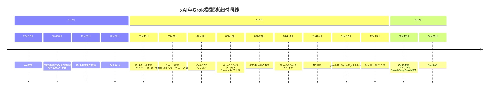

# Grok 模型发布时间线

本文件记录了 xAI 公司及其 Grok 模型发展的关键里程碑。

## 时间线图

```mermaid
timeline
    title xAI与Grok模型演进时间线
    section 2023年
        07月12日 : xAI成立
        08月18日 : 完成旗舰模型Grok-0的训练<br>包含330亿个参数
        11月03日 : Grok-1的抢先体验
        12月07日 : Grok On X
    section 2024年
        03月17日 : Grok-1开源发布<br>(Apache 2.0许可)
        03月28日 : Grok-1.5发布<br>增强推理能力与128K上下文窗口
        04月12日 : Grok-1.5V<br>视觉能力
        05月15日 : Grok-1.5 On X<br>向所有X Premium用户开放
        05月26日 : 60亿美元融资 B轮
        08月13日 : Grok-2及Grok-2 mini发布
        11月04日 : API发布
        12月12日 : grok-2-1212/grok-2/grok-2-latest
        12月23日 : 60亿美元融资 C轮
    section 2025年
        02月17日 : Grok3发布<br>Think、Big Brain与DeepSearch模式
        04月03日 : Grok3 API
```
