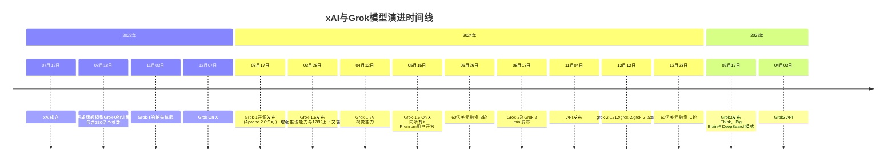

## 心智

时刻记住：这是马斯克的作品。xAI目前来看是第一梯队的大语言模型厂商。和谷歌、和OpenAI、和Anthropic是属于一个级别的。

# xAI

可以在 --> [company](https://x.ai/company) 了解xAI这家公司。我们都知道马斯克非常喜欢**X**。所以不出意外，在AI方面的公司也是叫x系列。

- 公司成立的时间是在：2023年7月12日。

《银河系漫游指南》是马斯克非常喜欢的一部科幻小说。xAI的使命是“理解宇宙的本质，了解人类的存在目的”。这也是《银河系漫游指南》的主题。“42”则是书中一个著名的梗，被称为“生命、宇宙及一切的终极答案”（The Answer to the Ultimate Question of Life, the Universe, and Everything）。

宣布成立的时间是 23（2023年） + 7 + 12 = 42。选择这天也是特别用心准备的。

## Grok 产品形态

Grok目前提供的产品形态整体分为3个系列，一个是X系列，一个是xAI系列（Grok），一个是API。

- X 系列：

  - 网页版本的X x.com ，X 平台（原 Twitter）的网页端
  - X App，X 平台的移动端应用 / 之前叫Twitter APP

- xAI 系列（Grok）：

  - grok.com 网站：独立的 Grok 网页应用
  - Grok iOS 应用：专门的 iOS 移动应用
  - Grok Android 应用：专门的 Android 移动应用

- xAI API：

  - xAI API：面向开发者的 API 接口（https://api.x.ai）

## 时间线图

