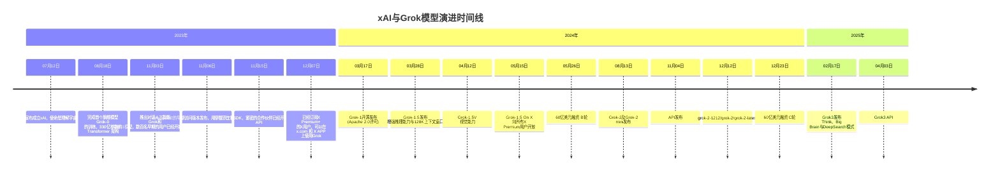

```mermaid
timeline
    title xAI与Grok模型演进时间线
    section 2023年
        07月12日 : 宣布成立xAI，使命是理解宇宙
        08月18日 : 完成首个旗舰模型 Grok-0 的训练，330亿参数的 Transformer 架构
        11月03日 : 推出对话人工智能 Grok和 Grok-1模型，数百名早期的用户已经开始使用Grok
        11月06日 : PromptIDE的早期访问版本发布，用于提示工程的集成开发环境
        11月15日 : 发布了首个SDK，紧密的合作伙伴已经开始使用Grok API
        12月07日 : 已经订阅X Premium+ 的X用户，可以在 x.com 和 X APP 上使用Grok
    section 2024年
        03月17日 : Grok-1开源发布<br>(Apache 2.0许可)
        03月28日 : Grok-1.5发布<br>增强推理能力与128K上下文窗口
        04月12日 : Grok-1.5V<br>视觉能力
        05月15日 : Grok-1.5 On X<br>向所有X Premium用户开放
        05月26日 : 60亿美元融资 B轮
        08月13日 : Grok-2及Grok-2 mini发布
        11月04日 : API发布
        12月12日 : grok-2-1212/grok-2/grok-2-latest
        12月23日 : 60亿美元融资 C轮
    section 2025年
        02月17日 : Grok3发布<br>Think、Big Brain与DeepSearch模式
        04月03日 : Grok3 API
```
